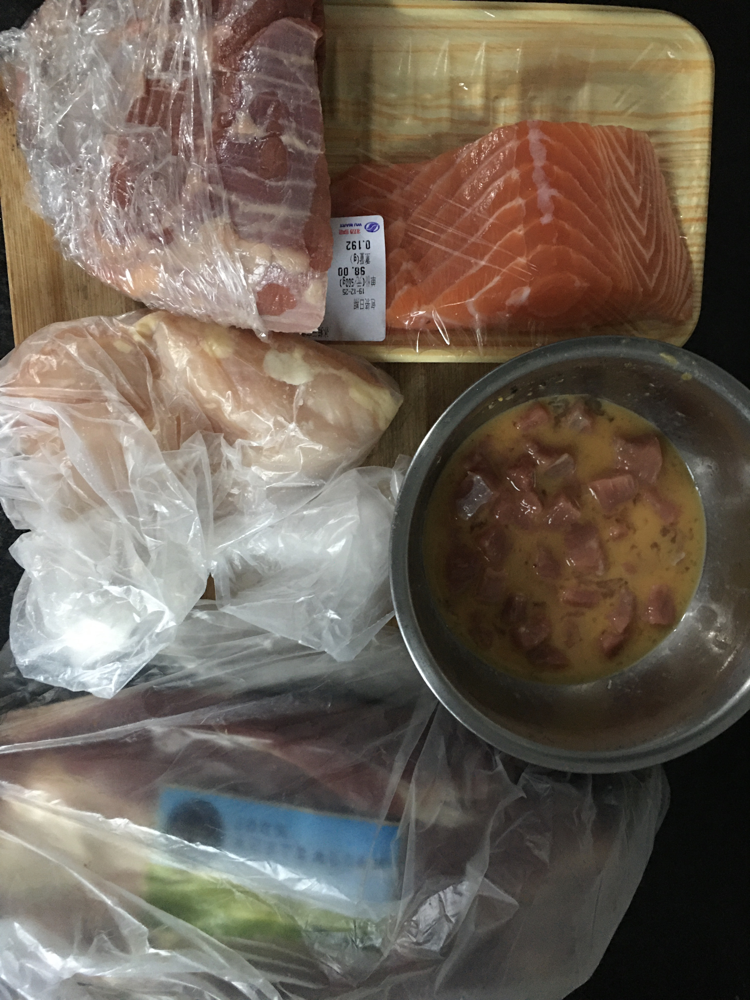
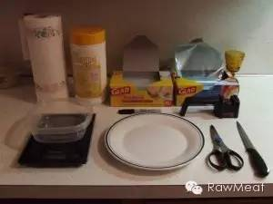
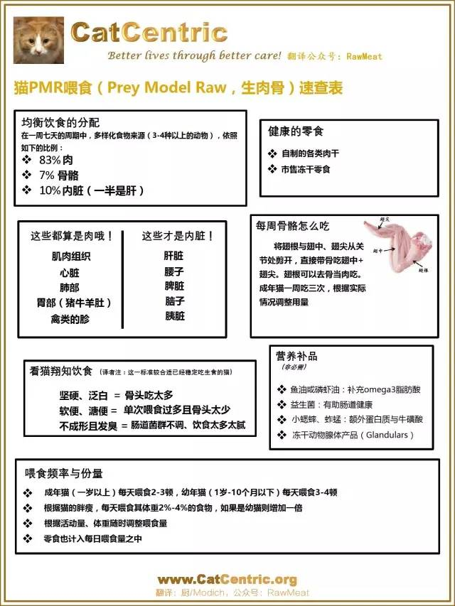

# 猫咪饮食

> 首先先抛出一个结论：本人还是比较推荐生骨肉，哪怕不能做成营养均衡的主食，就算是当零食吃，每周最好也给保持足量的鲜肉摄入，哪怕就是只有一块鸡胸肉，也好过天天吃肉粉小饼干。


## 一、 生骨肉能喂否

先说一下个人赞成生骨肉喂养。




群里面经常看到讨论生骨肉的话题，哎呀猫猫这么小，能不能给喂肉吃啊，是不是等半岁/一岁等等各种神奇的时间节点后再喂比较好呢，也不知道这个时间节点从哪来的。

众所周知，猫在野外都是吃荤的，各种小动物都是他的猎物，比如鱼、鸟等

亿万年的自然演化后最适应猫咪的饮食方式，居然被质疑不如近几十年才出现的，首先是为了饲主方便的才出现，其次才考虑到猫咪营养均衡的猫粮。

哪个更像骗局，我假装自己没看出来。


我们大家养猫，首先要明确的一点，**猫咪是肉食动物**，和我们不一样完完全全不一样。所以千万千万不要用自己的经验去类比猫咪所需要的的食物。人对蛋白质的代谢能力是有限的，如果过度摄入确实会对肾脏造成比较大的负荷。但是猫咪和人是完全全的两码事啊，猫是纯粹的肉食动物。

**肉食动物的意思就是，它的能量来源来自动物蛋白质和脂肪，完全不需要淀粉这些碳水化合物。**猫粮中含有大量的淀粉，并不是因为猫咪需要这些淀粉，而是做猫粮这种小饼干，不得不添加淀粉。

这些淀粉会对猫咪的消化造成比较大的压力，是造成家养猫粑粑臭破天际的主要原因，消化不了的淀粉在肠道内发酵，直到变成生化武器投放出来。所以我们能看到，越好的猫粮，淀粉含量越低，有的能低到20%以内，而一些不太好的猫粮中，可能有超过一半的成分都是猫咪不需要的淀粉。

实在理解不了不同动物食性不同的，建议从今天开始，天天吃干草，牛羊都是靠吃这个长了一身腱子肉的。就下图这个玩意。


是不是第一反应是，这TM能吃？？

没错，猫看着淀粉也是这种感觉。


**猫粮中除了必须添加的淀粉外，还有一个很致命的缺点，就是会导致猫咪慢性缺水。**

猫咪通常靠新鲜的肉类来补充水分，新鲜的肉类看着一大块肉，其实里边含水量真是不少，只不过这些水不是以自由流动的水的形式存在的，是结合水。

香蕉就是典型的结合水含量很高的水果，虽然咬一口感觉没什么汁水，但是本身却有高达80%左右的成分是水分。

掐断鲜肉这个补充水分的途径后，猫咪就只能依靠喝水来补充了，但是猫咪的天性又是不太喜欢去喝水的，所以长期干粮喂养，会导致猫咪慢性脱水。在猫咪老年后，脱水是导致尿路结石的最大元凶，尿路结石还是挺常见的一种毛病的。


所以对比来说，生骨肉相对猫粮的好处有：

1、更符合猫咪的天性，这是亿万年进化抉择的成果。

2、更多的动物蛋白。

3、更多的水分。

4、没有淀粉。


但是生骨肉也不是没有缺点：

1、相比猫粮喂食过于麻烦，这就是生骨肉一直被推荐，却始终是非主流的原因。亲自处理过生骨肉的恐怕想起肉类处理-分装-冷冻-解冻这个繁琐的流程就头疼。

2、有潜在的寄生虫风险，这也是很多萌新望而却步的原因，家用冰箱的冷冻可以有效处理掉绝大部分的寄生虫，其实问题没那么大，更何况现在有-40度冷冻的冰箱出现，寄生虫基本上无处可逃。


看了半天，猫粮和生骨肉都有很可怕的缺点，似乎啥都不能喂的样子，其实大可不必这么焦虑，只是需要额外的注意一些事情，比如生骨肉如何配比，如何除虫保证安全，猫粮如何补充水分，和充足的蛋白质等等，看起来是挺麻烦的，但是养宠从来都不是一个省事的事。

好在除了干粮和生骨肉，我们还有第三种懒人选择，猫罐头。

猫罐头综合了生骨肉和猫粮各自的优点--更方便，营养搭配更均衡，也避免了他们的缺点--缺水，缺足够量的动物蛋白，淀粉含量过于高。

需要注意的是猫罐头有主食和零食罐头的区分，有一个简单区分的方法：是否符合AAFCO的标准，符合AAFCO标准的可以认为是主食罐头，可以长期大量的食用；不符合AAFCO的就是零食罐头，当做日常调情的小奖励，长期食用会由于营养失衡出问题。这只是一个简单的标准，不过通常也可以了。

还有一种相当不可靠的说法是，主食罐头是肉泥状的，看着像松软的午餐肉，而零食罐头是食物本身的样子……

emmmmmmmmmm，对于这个说法无力吐槽，是否主食主要看搭配配比，和食物的形态没什么关系，主要还是看是否符合AAFCO标准吧。

不过需要避免的是，有不少号称主食罐的罐头，也含有大量的淀粉，如果说猫粮使用淀粉是因为做小饼干不得不使用，那就完全搞不懂罐头为什么会添加大量的淀粉了，是感觉吃肉菜不来点米饭吃不饱？？？配料表前三位出现淀粉/谷物的可以pass掉了，完全就是坑钱的玩意。

猫罐头的缺点嘛，贵。

所以个人结论是：**猫可以吃生骨肉**。


## 二、 生骨肉怎么吃


### 1. 比例

自制饮食最重要的一点就是需要营养均衡。要达到这一点，饮食中动物组织的比例是一大关键。生骨肉遵循的喂食习惯从不要求每一顿饭都精确无比，这很好理解，因为人/动物也不是每顿饭都算着来吃的。在一段周期内饮食配比均衡就足够了。

这个周期通常是一周。猫的饮食比例遵循以下：

```
7-10%骨骼 （初期可蛋壳粉代替，添加量后详）

4-5% 肝脏（必须）

80-85%肌肉组织（包括心脏，胗）

5% 其他内脏 （脑、腰、胰、脾，非必须，有最好）
```

**如何才算“太多心”？：心脏富含牛磺酸，每天吃5个以上鸡鸭兔心都是可以的！**


### 2. 添加物

这边我不会说的太复杂把你们吓跑（笑）我是不倾向使用昂贵预拌粉这类产品的，事实上大量国外生食喂养者也不会使用，因为没有任何的必要。以下这些仅仅需要几十元。以下5项中，大半在特定情况下能省略，大部分添加频率不是每天，并不费力。

接触生骨肉喂食你需要以下的补充品：


- **蛋壳粉**

​    极端重要的钙质来源，切忌省略。没有做到7%骨骼摄入前每餐添加。准备好**量勺（淘宝购买，1/2茶勺及1/8茶勺都是很好的）**，二分之一茶勺即2.5ml蛋壳粉大约对应450g纯肉/肝脏，可适当浮动20-30%。**不要凭感觉放！实际量比你想象的多。**购买来源找淘宝。如何精确添加请参考工具篇。


- **维生素E**

购买人用的维生素E软胶囊，**100IU版本**，且必须是**【天然型】**。价格约30元内，不用买高价产品。频率一周**一粒**，未成年猫或小体格猫咪可以将这一周期改成一周半到两周**一粒**。这方面的详细解释请看第四章【释义篇】的脂溶性维生素条目。


- **综合维生素B** 

​    水溶性维生素，不存在过量。故直接药店购买人用版本，100片2元。每一到两天添加一片即可。如果能够大量食用鸭肉、鸭肝，视情况可省略。

拓展阅读：[维生素B族详解：看着那些术语犯愁呢？大可不必！](http://mp.weixin.qq.com/s?__biz=MzI0NzE0MDcyMA==&mid=2650692342&idx=1&sn=cbecd29a3a02811cab5fd3d00215da6a&scene=21#wechat_redirect)


- **牛磺酸**

​    虽然我本人倾向于认为大量的心脏和足够比例的肝脏提供了充足的牛磺酸，但是保险起见还是写在这里。**冷冻并不会完全毁掉牛磺酸，但的确会让其损失一部分。（引用1）**

暂时不存在过量值，每两天给一撮即可。淘宝购买，20元内。没有必要买高价进口产品，全部中国生产，品质一样。需要注意的是，虽然有提供了这种合成牛磺酸并不代表你的猫就不吃心脏了，心脏还是多吃一些。如果能经常、足量食用禽类、牛羊心脏，可以省略。


**Omega-3脂肪酸**

  每一周到一周半喂自家猫 100-200g （按成年9斤猫算） 新鲜购买的，烹饪并去骨的秋刀鱼/鲅鱼/鲐鱼/青占鱼等可以满足omega3脂肪酸需求（**请不要用鳕鱼，金枪鱼，龙利鱼替代**）。同时鱼是极为关键的维生素D及碘元素来源，故更推荐吃鱼而不是吃鱼油。


### 3. 冷冻

| **类别**       | **冰冻时间**                                     |
| -------------- | ------------------------------------------------ |
| 品牌冷鲜禽类   | 三至四天                                         |
| 较新鲜冷冻禽类 | 无需                                             |
| 活杀鹌鹑       | 三至四天                                         |
| 品牌鲜猪肉     | 小块分割冷冻22-30天                              |
| 冷冻牛羊肉     | 进口肉类可以直接吃，新鲜牛羊切**小块**冻**10**天 |
| 鱼生           | 七天 （但推荐熟吃）                              |
| 新鲜兔肉       | 五天以上，观察腹腔有无异状                       |
| 冷冻鸡鸭兔心肝 | 无需                                             |


| **季节/室温**    | **解冻方式**                               |
| ---------------- | ------------------------------------------ |
| 春夏             | 置于密封袋后泡水解冻，需2小时完成。        |
| 夏，室温较高     | 提前12小时将食材置于冷藏室解冻（四季皆可） |
|                  |                                            |
| 冬，室温10度以下 | 可室温解冻或密封泡水解冻，3-6小时          |

**解冻完成后请尽快喂食。如开始发粘则丢弃。**


### 4. 卫生

- 所有用于生骨肉喂食的肉都需要经过冷冻处理。
- 需要解冻时，请密封后，提前放置于冰箱冷藏室解冻,或用温/凉水快速解冻，切忌高室温情况下放在空气中解冻！
- 牢记并认真执行卫生操作习惯，事后擦洗台面、刀具、设备，用肥皂彻底洗手（其实很简单很普通，对不对？洗手！）
- 不要让宠物在灶台、厨房台面上乱窜。
- 如果宠物有剩饭，超过1小时，尽快扔掉
- 肥皂不要掉地上哟


## 三、 动手实践

### 1. 需要什么工具

你所需要准备的工具并不多，非常简便，全部可以淘宝，合起来不足百元。

1. 剪刀
2. 电子秤
3. 量勺
4. 便宜的塑料保鲜袋
5. Ziploc防水袋
6. 可选）一口不粘锅
7. 一个砧板




### 2. 喂多少？多久喂？

这里就需要各位自己做一下数学和好好用电子秤了。喂食量方面狗与猫食量一样。


- 成年猫/狗每日食量  体重的3%-4%，酌情增加（如发情/哺乳）
- 幼年猫/狗每日食量  体重的10%，8%，6% （按年龄增长递减）
- 肥胖猫/狗每日食量  体重的2%-2.5%


**那么，需要多久喂一次呢？**

建议是幼年至少3次每天，4次5次更佳；成年最少2次每天，但是3次每天一定更好，喂食次数过少很可能造成呕吐。

每次喂食的间隔务必至少达到**4-5小时以上**，过度频繁或者单次过量的饮食容易出现腹泻与软便。猫与狗需要适当的空腹和饥饿感以促进机体的正常运转，他们不需要吃太多。


> **”FAST YOUR CAT“：这不是快的意思，这里fast是指禁食。如同大型猫科表亲狮、虎一样，适当的饥饿与断食有利猫的健康。如果你的猫没有肥胖过度，每周挑一天禁食18-20个小时对消化系统是有好处的。（还是要给水哦！超过20小时不合适，误试）**


### 3. 如何加工

任何食物在**解冻**后，置于密封袋泡在40-50度（比平时的洗澡水烫一些的感觉）的热水中至温热（大约15-20分钟）就可以喂食了，切块后温热速度会更快一些。

如果食物没有密封直接泡水，不仅气味失去大半，也给了细菌增殖和水溶维生素流失更多机会，这也是为何我推荐大家用 Ziploc 密封袋作为温肉的必备工具----可以重复使用又不渗水。


鸡胸鸭胸和大块猪牛羊怎么办？

可以同样选择上面的隔水泡温，也可以选择：无油煎。锅**烧够热后**放入肉。两面各几十秒到一分钟内，立刻关火。这时候如果是工作日的早晨，你可以去忙洗漱或者其他的。锅的余温会将肉的内部温至30度左右，并不会造成肉被烹熟。


## 四、 食谱拟定与范例

菜谱的拟定可以复杂异常，也可以用逻辑简单思考得出结果:猫野外怎么吃，我们怎么模仿其比例。大原则永远不变：新鲜的食材，符合肉类、骨骼、内脏比例（83：7：10），足够多样的动物种类（就靠鸡鸭？万万不可）。




食谱范例：针对入门者的初级版本，会吃骨头的进阶版版本**

第一种是基本无骨骼喂食计划表，针对入门者进行了极端的简化，未进行部分微量矿物质的平衡，保证最基础的维生素、蛋白质、脂肪、钙、磷、镁、钾、钠、铁、锌。**该初级版计划表不合适使用超过半年**。已经非常简单了，所以如果没有信心请**不要再简化**

请随意调换顺序，哪怕你某一天全部喂鸡肉也可以，但是要把缺失的部份在一周内补回。维生素b和牛磺酸可以在每天的任何一顿中添加，一次即可。**蛋壳粉则每顿需要**。

> *再次提醒，肝脏占总量的5%。肉的种类多多益善，\*只吃鸡肉要不得。**蛋壳粉二分之一茶勺，也就是2.5ml对应450g-500g肉，是初级版必须的添加品。**

- 橙色是早餐

- 绿色是正餐，喂食时间下班后

- 粉色是睡前餐，喂食时间睡觉前


| 周一                 | 周二     | 周三     | 周四     | 周五     | 周六          | 周日     | 喂食时间   |
| -------------------- | -------- | -------- | -------- | -------- | ------------- | -------- | ---------- |
| 任意禽肉             | 任意禽肉 | 禽类心脏 | 任意禽肉 | 去皮鸭胸 | 禽肉+非肝内脏 | 牛肉或羊 | 早上喂食   |
|                      |          |          |          |          |               |          |            |
| 鸡腿带皮             | 牛肉或羊 | 海鱼     | 鸡腿带皮 | 任意禽肉 | 任意肉类      | 去皮鸭胸 | 下班后喂食 |
| *四至五小时以上间隔* |          |          |          |          |               |          |            |
| 鸡蛋黄               | 禽类肝脏 | 任意肉类 | 鸡蛋黄   | 禽类心脏 | 任意肝脏      | 禽类心脏 | 睡觉前喂食 |


接下来是进阶版。这是较为理想的、带骨骼、无需蛋壳粉的版本。在你的猫习惯生食与大致学会初步的如何吃骨头后，半年内过渡到这个版本是有必要的。此版本来源是catcentric.org，我根据国内食材作了细微变动，顺序依旧可以按需求变动。你也可以继续修改，越丰富多样，就是越好的。别忘记内脏！大脑、腰子都是非常好的食物。

| 周一                 | 周二               | 周三         | 周四        | 周五               | 周六         | 周日         | 喂食时间   |
| -------------------- | ------------------ | ------------ | ----------- | ------------------ | ------------ | ------------ | ---------- |
| 鸡鸭牛心任选         | 大块肉类任选       | 鸡鸭牛心任选 | 大块猪肉    | 鸭肉               | 大块牛羊任选 | 大块牛羊任选 | 早上喂食   |
|                      |                    |              |             |                    |              |              |            |
| 海鱼                 | 鸡琵琶腿           | 带骨兔或鹌鹑 | 带骨兔肉    | 任意肉+非肝内脏    | 鸡腿或鹌鹑   | 整块鸡边腿   | 下班后喂食 |
| *四至五小时以上间隔* |                    |              |             |                    |              |              |            |
| 带骨兔肉             | 肝脏为主，搭配心脏 | 1-2个鸡翅    | 鸡鸭肉+蛋黄 | 肝脏为主，搭配心脏 | 1-2个鸡翅    | 鸭肉+蛋黄    | 睡觉前喂食 |


## 五、 名词解释

能看到这里的我需要给你鼓掌咯，接下来我简单提一些容易忽略或者配方组合时可能遇到的麻烦，不会讲的非常详细，免的把你看花眼，此外讲太细的话------我以后的想找题材填坑不就麻烦了么（笑）。资料来源很多来自NRC的《Nutrient requirements of dogs and cats》2006版。


- **维生素A**：肝脏富含维生素A，是猫维生素A的最主要来源，**猫必须吃动物肝脏。**许多人知道维生素A过量会中毒，但是从来没人告诉你多少维生素A，吃多久会中毒。维生素A中毒量为：每公斤体重摄入超过57000IU 维生素A，每天如此，超过1-2个月（引用2）。这意味着我家4公斤的阿布得每天吃19副鸡肝（800g）连续一个月才可能中毒。

- **维生素D**：维生素D在陆地动物身上存量不是很多，至少字面如此。好消息是鱼类有极高含量的维生素D，所以，请记得给你的猫吃一些海鱼，不用很多，一周到一周半给100g就可以了。
- **维生素E：**你如果查询了每种肉食的维生素E含量，会发现无论怎么喂，维生素E似乎和NRC对外发布的标准（8斤猫日需求10mg）差了一截？实际上，维生素E的需求量并不是那么简单。如果摄入太多长链多不饱和脂肪酸（来自鱼），维生素E的需求量会陡然增加多倍，坏消息是很多猫粮猫罐头是鱼做出来，所以NRC做了妥协。当我们实际喂猫的时候，大部分的肉食搭配肝脏后所有的维生素E含量是卡及格线的。（引用3）但是考虑到我们依旧会喂鱼，甚至很多饲主喂食的肉太瘦（脂溶性维生素可是在脂肪里！），而且我不喜欢卡及格线，所以在添加物条目里加入了100IU维生素E。
- **维生素K**：不需要额外补充，猫大肠菌群可以合成不少。


脂肪呀脂肪！很多人觉得，猫不该吃太油，这没错，是不该太油，但也不能一天到晚鸡胸肉啊？

>  脂肪对猫来说不只是正常代谢需求，还是重要的脂溶性维生素来源。猫目前的脂肪需求我使用了2项研究倒推：一个是野化家猫的猎物分析（引用4），一个是猫天生的口味偏好（引用5）。得出完全相同的结果，猫对脂肪的需求量大约是：**含脂率8-10%**，这个含脂率大约相当于去皮鸡大腿，大家感受下。


各种各样的宣传说言论都说“缺乏微量元素、矿物质会xxxxx”这种营销式的说辞忽悠了不少人。这次我不赘述猫需要什么什么矿物质，怎么满足-----实际上饮食都能满足，我就单独说一下容易走误区的几个。


- **钙质**

  “补钙”一说并不精确，已经有的再额外添加，那叫补。猫则是不人为添加蛋壳粉/钙粉，或者不吃骨头的话，钙质来源是完全全全的0，所以钙质可千万不能略过

- **锰**

  如果你用USDA数据库计算肉食的锰含量，你一定会绝望，因为数值太低了，根本不符合NRC对外发布的标准（4.8mg/kg食物，肉类含量介于2-3.3mg/kg）。事实却是：锰需求量是本糊涂账，精确的需求量不明，过量后果也不明。流程大致如下：

- *1960年的研究使用每公斤含锰2.28mg的肉类（purified diet）长时间喂食幼猫没发现问题。*

- 1964年、1975年的研究建议成年猫饮食需要每公斤含锰3.2mg的食物，但是没有提供支持该观点的数据。

- *有人表示猫粮（standard diet）**中的锰生物活性不如肉食，吸收程度更差，所以要改掉需求量，又参考了其他动物的需求量，大笔一挥改为每公斤食物中需要含锰4.8mg。*

  不用介意锰元素了，让科学家自己理清楚再说吧。

-  **锌元素**

  猫作为纯肉食动物，有着极高的锌元素需求量，相比成年人，一只成年猫每公斤体重需要1.2毫克的锌元素，5公斤的大猫咪一天可以要6mg的锌，而一个成年人类男性需求量也只是11毫克而已。

  应对办法：多吃一些牛羊肉（包括内脏），牛羊肉是高锌含量的翘楚，搭配其他肉类中的锌含量，成年猫一周吃200g左右牛羊肉就很合适了。


## 六、 鱼

对于猫这种自然食谱里完全没鱼类的动物，过量吃不该吃的东西永远是危险的，更不要提目前海鱼受到的严重污染（PBDE、PCB、汞）

可惜我们没法完美还原猫的自然饮食，不得不给猫适当吃一些海鱼以补充维生素D、碘、omega3脂肪酸。

**可别吃多！**

**海鱼严重的污染与甲状腺亢进疾病有不可分割的联系，鱼类又大幅度增加猫的维生素E需求量，更不要提很多鱼罐头的原料质量简直臭不可闻。如果要吃鱼，浅海、短生命周期的：鲭鱼、马鲛鱼、秋刀鱼都是好选择，干净的三文鱼也是很棒的。**


注：部分文字来自网络，因为意思表达也是我所想，所以做了资源聚合。